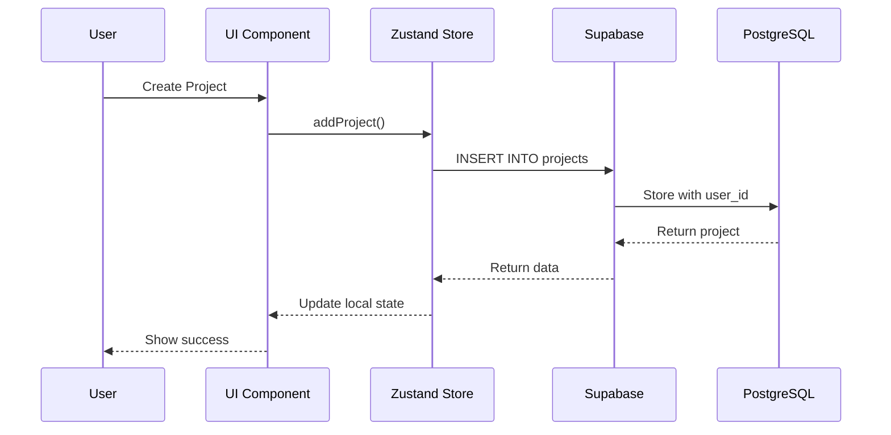
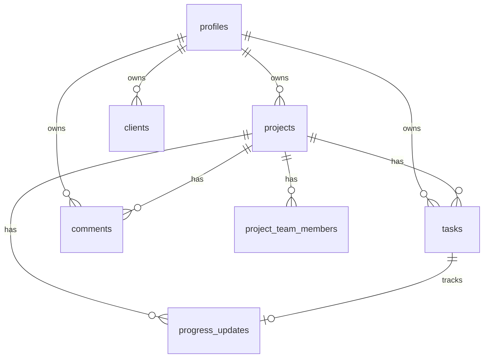

# ContractorAI Architecture

## System Overview

```mermaid
graph TB
    subgraph "Frontend (React + TypeScript)"
        UI[User Interface]
        PM[Project Manager]
        CM[Client Manager]
        FT[Finance Tracker]
        PC[Pricing Calculator]
        EST[Estimate Generator]
        CAL[Calendar]
        AD[Ad Analyzer]
    end

    subgraph "State Management (Zustand)"
        PS[projectStore]
        CS[clientsStore]
        FS[financeStore]
        ES[estimateStore]
    end

    subgraph "Backend (Supabase)"
        AUTH[Authentication]
        DB[(PostgreSQL Database)]
        RLS[Row Level Security]
        STOR[Storage Bucket]
    end

    subgraph "Database Tables"
        PROF[profiles]
        PROJ[projects]
        CLI[clients]
        TSK[tasks]
        COM[comments]
        TM[project_team_members]
        PU[progress_updates]
        FE[finance_expenses]
        FP[finance_payments]
        FR[finance_recurring]
        FB[finance_budgets]
        CE[calendar_events]
        AC[ad_campaigns]
        EST_T[estimates]
        CALC[calculations]
    end

    UI --> PM
    UI --> CM
    UI --> FT
    UI --> PC
    UI --> EST
    UI --> CAL
    UI --> AD

    PM --> PS
    CM --> CS
    FT --> FS
    EST --> ES

    PS --> DB
    CS --> DB
    FS --> DB
    ES --> DB

    DB --> PROF
    DB --> PROJ
    DB --> CLI
    DB --> TSK
    DB --> COM
    DB --> TM
    DB --> PU
    DB --> FE
    DB --> FP
    DB --> FR
    DB --> FB
    DB --> CE
    DB --> AC
    DB --> EST_T
    DB --> CALC

    AUTH --> PROF
    RLS --> DB
    STOR --> PU
    STOR --> COM
```



## Data Flow

### Project Management Flow


## Component Architecture

### Project Manager Module
```
ProjectManager/
├── Components/
│   ├── ProjectCard.tsx
│   ├── ProjectDetails.tsx
│   ├── TasksTab.tsx
│   ├── CommentsTab.tsx
│   ├── TeamTab.tsx
│   └── ProgressTab.tsx
├── Store/
│   └── projectStore.ts
└── Types/
    └── project.types.ts
```

## Database Schema

### Core Tables
- **profiles**: User authentication and profile data
- **projects**: Project information with client_name (TEXT)
- **clients**: Client information
- **tasks**: Project tasks with project_id reference
- **comments**: Project comments with project_id reference
- **project_team_members**: Team members per project
- **progress_updates**: Progress tracking with photos

### Table Relationships


## Security Architecture

### Row Level Security (RLS)
- All tables use `user_id` for access control
- RLS policies check `auth.uid()` against `user_id`
- Currently disabled for testing (must be re-enabled for production)

### Authentication Flow
```mermaid
graph LR
    A[User Login] --> B[Supabase Auth]
    B --> C[Get auth.uid()]
    C --> D[Match with profiles.id]
    D --> E[Access user data]
    E --> F[RLS filters by user_id]
```

## API Integration Points

### Supabase Client Configuration
```typescript
const supabase = createClient(
  SUPABASE_URL,
  SUPABASE_ANON_KEY
)
```

### Store Pattern
```typescript
// Consistent pattern across all stores
const useStore = create((set, get) => ({
  data: [],
  isLoading: false,
  error: null,
  
  fetchData: async () => {
    const userId = await getCurrentUserId()
    // Fetch with RLS
  },
  
  addItem: async (item) => {
    const userId = await getCurrentUserId()
    // Insert with user_id
  }
}))
```

## Deployment Considerations

### Environment Variables
- `VITE_SUPABASE_URL`
- `VITE_SUPABASE_ANON_KEY`

### Production Checklist
1. Enable RLS on all tables
2. Configure proper authentication
3. Set up storage buckets with policies
4. Configure CORS for production domain
5. Set up database backups
6. Monitor performance metrics

## Scalability Points

### Current Limitations
- Single database instance
- Client-side state management
- No caching layer

### Future Enhancements
- Add Redis caching
- Implement server-side pagination
- Add real-time subscriptions
- Implement offline support
- Add API rate limiting