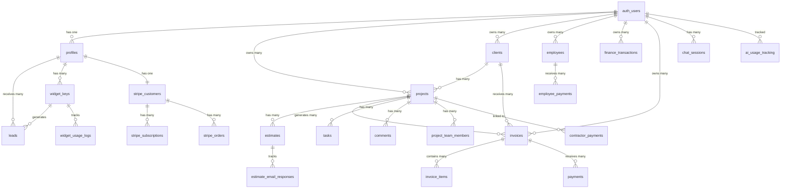

# ContractorAI Database Schema Documentation

**Project:** ContractorAI v2
**Database:** Supabase (PostgreSQL)
**Generated:** 2025-11-04
**Total Tables:** 25
**Total Migrations:** 55+

---

## Table of Contents

1. [Overview](#overview)
2. [Entity Relationship Diagram](#entity-relationship-diagram)
3. [Core Tables](#core-tables)
4. [Financial Tables](#financial-tables)
5. [Customer Management](#customer-management)
6. [Payment & Subscription](#payment--subscription)
7. [Widget & Lead Generation](#widget--lead-generation)
8. [Project Management](#project-management)
9. [AI Features](#ai-features)
10. [Relationships Map](#relationships-map)
11. [Indexes & Performance](#indexes--performance)
12. [Enums & Constraints](#enums--constraints)
13. [Security (RLS Policies)](#security-rls-policies)
14. [Migration History](#migration-history)

---

## Overview

The ContractorAI database is designed to support a comprehensive contractor management system with features including:
- User authentication and profile management
- Financial tracking (income, expenses, invoices, payments)
- Client and project management
- Subscription billing (Stripe integration)
- Lead generation widgets
- AI-powered calculators and chatbot
- Payroll and contractor payments

All tables implement Row Level Security (RLS) to ensure data isolation per user/contractor.

---

## Entity Relationship Diagram

---

## Core Tables

### 1. profiles

**Purpose:** Extended user profile information for contractors

| Column | Type | Constraints | Description |
|--------|------|-------------|-------------|
| id | UUID | PK, FK → auth.users(id) | User identifier |
| email | TEXT | UNIQUE, NOT NULL | User email address |
| full_name | TEXT | | Full name of contractor |
| company_name | TEXT | | Business name |
| phone | TEXT | | Contact phone number |
| subscription_status | TEXT | CHECK (active, inactive, trialing, past_due, canceled, unpaid) | Current subscription state |
| subscription_id | TEXT | | Stripe subscription ID |
| subscription_plan | TEXT | CHECK (free, basic, pro, enterprise) | Plan tier |
| subscription_start_date | TIMESTAMPTZ | | Start of current period |
| subscription_end_date | TIMESTAMPTZ | | End of current period |
| stripe_customer_id | TEXT | | Stripe customer reference |
| created_at | TIMESTAMPTZ | DEFAULT NOW() | |
| updated_at | TIMESTAMPTZ | DEFAULT NOW() | |

**Indexes:**
- `idx_profiles_subscription_status`
- `idx_profiles_subscription_id`
- `idx_profiles_stripe_customer_id`
- `idx_profiles_subscription_end_date` (partial index)

**RLS Policies:**
- Users can view own profile
- Users can update own profile
- Users can insert own profile

**Triggers:**
- `on_auth_user_created` - Auto-creates profile on user signup

---

### 2. clients

**Purpose:** Customer/client records for contractors

| Column | Type | Constraints | Description |
|--------|------|-------------|-------------|
| id | UUID | PK, DEFAULT gen_random_uuid() | Client identifier |
| user_id | UUID | FK → auth.users(id), NOT NULL | Contractor who owns this client |
| name | TEXT | NOT NULL | Client name |
| email | TEXT | NOT NULL | Client email |
| phone | TEXT | NOT NULL | Client phone |
| company | TEXT | | Company name |
| address | TEXT | | Street address |
| city | TEXT | | City |
| state | TEXT | | State/Province |
| zip | TEXT | | ZIP/Postal code |
| notes | TEXT | | Internal notes |
| status | TEXT | DEFAULT 'active', CHECK (active, inactive, prospect) | Client status |
| created_at | TIMESTAMPTZ | DEFAULT NOW() | |
| updated_at | TIMESTAMPTZ | DEFAULT NOW() | |

**Indexes:**
- `idx_clients_user_id`
- `idx_clients_status`
- `idx_clients_created_at` (DESC)

**RLS Policies:**
- Users can view own clients
- Users can insert own clients
- Users can update own clients
- Users can delete own clients

**Triggers:**
- `update_clients_updated_at` - Auto-updates timestamp

---

### 3. employees

**Purpose:** Employee records for payroll tracking

| Column | Type | Constraints | Description |
|--------|------|-------------|-------------|
| id | UUID | PK, DEFAULT uuid_generate_v4() | Employee identifier |
| user_id | UUID | FK → auth.users(id), NOT NULL | Contractor who owns this employee |
| name | TEXT | NOT NULL | Employee name |
| email | TEXT | NOT NULL | Employee email |
| phone | TEXT | NOT NULL | Employee phone |
| job_title | TEXT | NOT NULL | Position/role |
| hourly_rate | DECIMAL(10,2) | DEFAULT 0, NOT NULL | Hourly pay rate |
| notes | TEXT | | Internal notes |
| status | TEXT | DEFAULT 'active', CHECK (active, inactive) | Employment status |
| created_at | TIMESTAMPTZ | DEFAULT NOW() | |
| updated_at | TIMESTAMPTZ | DEFAULT NOW() | |

**Indexes:**
- `idx_employees_user_id`
- `idx_employees_status`

**RLS Policies:**
- Users can view their own employees
- Users can create their own employees
- Users can update their own employees
- Users can delete their own employees

**Triggers:**
- `update_employees_updated_at` - Auto-updates timestamp

---

## Financial Tables

### 4. finance_transactions

**Purpose:** General ledger for income and expenses

| Column | Type | Constraints | Description |
|--------|------|-------------|-------------|
| id | UUID | PK, DEFAULT gen_random_uuid() | Transaction identifier |
| user_id | UUID | FK → auth.users(id), NOT NULL | Transaction owner |
| description | TEXT | NOT NULL | Transaction description |
| amount | DECIMAL(10,2) | NOT NULL | Transaction amount |
| type | TEXT | NOT NULL, CHECK (income, expense) | Transaction type |
| category | TEXT | NOT NULL | Category for reporting |
| date | DATE | NOT NULL | Transaction date |
| created_at | TIMESTAMPTZ | DEFAULT NOW() | |
| updated_at | TIMESTAMPTZ | DEFAULT NOW() | |

**Indexes:**
- `idx_finance_transactions_user_id`
- `idx_finance_transactions_date`

**RLS Policies:**
- Users can view own transactions
- Users can create own transactions
- Users can update own transactions
- Users can delete own transactions

---

### 5. recurring_expenses

**Purpose:** Scheduled recurring expenses

| Column | Type | Constraints | Description |
|--------|------|-------------|-------------|
| id | UUID | PK, DEFAULT gen_random_uuid() | Expense identifier |
| user_id | UUID | FK → auth.users(id), NOT NULL | Expense owner |
| name | TEXT | NOT NULL | Expense name |
| amount | DECIMAL(10,2) | NOT NULL | Expense amount |
| frequency | TEXT | NOT NULL, CHECK (monthly, quarterly, yearly) | Payment frequency |
| category | TEXT | NOT NULL | Expense category |
| next_payment | DATE | | Next scheduled payment |
| active | BOOLEAN | DEFAULT true | Whether expense is active |
| created_at | TIMESTAMPTZ | DEFAULT NOW() | |
| updated_at | TIMESTAMPTZ | DEFAULT NOW() | |

**Indexes:**
- `idx_recurring_expenses_user_id`

**RLS Policies:**
- Users can view own recurring expenses
- Users can create own recurring expenses
- Users can update own recurring expenses
- Users can delete own recurring expenses

---

### 6. invoices

**Purpose:** Customer invoices for billing

| Column | Type | Constraints | Description |
|--------|------|-------------|-------------|
| id | UUID | PK, DEFAULT gen_random_uuid() | Invoice identifier |
| invoice_number | TEXT | UNIQUE, NOT NULL | Formatted invoice number (INV-YYYY-XXXXX) |
| invoice_date | DATE | NOT NULL, DEFAULT CURRENT_DATE | Invoice issue date |
| due_date | DATE | NOT NULL | Payment due date |
| user_id | UUID | FK → auth.users(id), NOT NULL | Contractor |
| project_id | UUID | FK → projects(id) | Related project |
| client_id | UUID | FK → clients(id), RESTRICT | Client being invoiced |
| estimate_id | UUID | FK → estimates(id) | Related estimate |
| subtotal | DECIMAL(12,2) | NOT NULL, DEFAULT 0 | Pre-tax amount |
| tax_rate | DECIMAL(5,2) | DEFAULT 0 | Tax percentage |
| tax_amount | DECIMAL(12,2) | DEFAULT 0 | Calculated tax |
| discount_amount | DECIMAL(12,2) | DEFAULT 0 | Discount applied |
| total_amount | DECIMAL(12,2) | NOT NULL | Final total |
| paid_amount | DECIMAL(12,2) | NOT NULL, DEFAULT 0 | Amount paid |
| balance_due | DECIMAL(12,2) | NOT NULL | Remaining balance |
| status | TEXT | NOT NULL, DEFAULT 'draft', CHECK (draft, pending, sent, viewed, partial, paid, overdue, cancelled, refunded) | Invoice status |
| payment_status | TEXT | NOT NULL, DEFAULT 'unpaid', CHECK (unpaid, partial, paid, refunded) | Payment status |
| payment_terms | TEXT | DEFAULT 'net_30' | Payment terms |
| late_fee_percentage | DECIMAL(5,2) | DEFAULT 0 | Late fee rate |
| late_fee_amount | DECIMAL(12,2) | DEFAULT 0 | Late fee amount |
| notes | TEXT | | Invoice notes |
| terms_conditions | TEXT | | Terms and conditions |
| footer_text | TEXT | | Footer text |
| email_sent_at | TIMESTAMPTZ | | Email sent timestamp |
| email_opened_at | TIMESTAMPTZ | | Email opened timestamp |
| last_reminder_sent_at | TIMESTAMPTZ | | Last reminder sent |
| reminder_count | INTEGER | DEFAULT 0 | Number of reminders |
| pdf_url | TEXT | | Generated PDF URL |
| pdf_generated_at | TIMESTAMPTZ | | PDF generation time |
| stripe_payment_intent_id | TEXT | | Stripe payment intent |
| stripe_invoice_id | TEXT | | Stripe invoice ID |
| metadata | JSONB | DEFAULT '{}' | Additional metadata |
| created_at | TIMESTAMPTZ | DEFAULT NOW() | |
| updated_at | TIMESTAMPTZ | DEFAULT NOW() | |
| voided_at | TIMESTAMPTZ | | Void timestamp |
| paid_at | TIMESTAMPTZ | | Paid timestamp |

**Indexes:**
- `idx_invoices_user_id`
- `idx_invoices_client_id`
- `idx_invoices_project_id`
- `idx_invoices_status`
- `idx_invoices_payment_status`
- `idx_invoices_due_date`
- `idx_invoices_invoice_date`
- `idx_invoices_stripe_payment_intent`

**RLS Policies:**
- Users can view own invoices
- Users can insert own invoices
- Users can update own invoices
- Users can delete own invoices

**Triggers:**
- `invoice_totals_trigger` - Calculates balance_due and payment_status
- `update_invoices_updated_at_trigger` - Updates timestamp

**Functions:**
- `generate_invoice_number()` - Generates sequential invoice numbers
- `calculate_invoice_totals()` - Calculates totals and status

---

### 7. invoice_items

**Purpose:** Line items for invoices

| Column | Type | Constraints | Description |
|--------|------|-------------|-------------|
| id | UUID | PK, DEFAULT gen_random_uuid() | Item identifier |
| invoice_id | UUID | FK → invoices(id), CASCADE, NOT NULL | Parent invoice |
| user_id | UUID | FK → auth.users(id), NOT NULL | Owner |
| item_order | INTEGER | NOT NULL | Display order |
| description | TEXT | NOT NULL | Item description |
| item_type | TEXT | DEFAULT 'service', CHECK (service, material, labor, equipment, other) | Type of item |
| quantity | DECIMAL(10,2) | NOT NULL, DEFAULT 1 | Quantity |
| unit_price | DECIMAL(12,2) | NOT NULL | Price per unit |
| discount_percentage | DECIMAL(5,2) | DEFAULT 0 | Discount rate |
| discount_amount | DECIMAL(12,2) | DEFAULT 0 | Discount amount |
| subtotal | DECIMAL(12,2) | NOT NULL | Subtotal after discount |
| tax_rate | DECIMAL(5,2) | DEFAULT 0 | Tax rate |
| tax_amount | DECIMAL(12,2) | DEFAULT 0 | Tax amount |
| total | DECIMAL(12,2) | NOT NULL | Line total |
| notes | TEXT | | Item notes |
| metadata | JSONB | DEFAULT '{}' | Additional metadata |
| created_at | TIMESTAMPTZ | DEFAULT NOW() | |
| updated_at | TIMESTAMPTZ | DEFAULT NOW() | |

**Indexes:**
- `idx_invoice_items_invoice_id`
- `idx_invoice_items_user_id`
- `idx_invoice_items_order` (invoice_id, item_order)

**RLS Policies:**
- Users can view own invoice items
- Users can insert own invoice items
- Users can update own invoice items
- Users can delete own invoice items

**Triggers:**
- `line_item_totals_trigger` - Calculates line totals
- `update_invoice_from_items_trigger` - Updates parent invoice totals
- `update_invoice_items_updated_at_trigger` - Updates timestamp

---

### 8. payments

**Purpose:** Payment records for invoices

| Column | Type | Constraints | Description |
|--------|------|-------------|-------------|
| id | UUID | PK, DEFAULT gen_random_uuid() | Payment identifier |
| invoice_id | UUID | FK → invoices(id), CASCADE, NOT NULL | Related invoice |
| user_id | UUID | FK → auth.users(id), NOT NULL | Owner |
| payment_number | TEXT | UNIQUE, NOT NULL | Payment number (PAY-YYYY-XXXXX) |
| payment_date | DATE | NOT NULL, DEFAULT CURRENT_DATE | Payment date |
| amount | DECIMAL(12,2) | NOT NULL, CHECK (amount > 0) | Payment amount |
| payment_method | TEXT | NOT NULL, CHECK (credit_card, debit_card, bank_transfer, check, cash, other) | Method of payment |
| stripe_payment_intent_id | TEXT | UNIQUE | Stripe payment intent |
| stripe_charge_id | TEXT | | Stripe charge ID |
| stripe_payment_method_id | TEXT | | Stripe payment method |
| status | TEXT | NOT NULL, DEFAULT 'pending', CHECK (pending, processing, succeeded, failed, cancelled, refunded) | Payment status |
| reference_number | TEXT | | External reference |
| notes | TEXT | | Payment notes |
| metadata | JSONB | DEFAULT '{}' | Additional metadata |
| refund_amount | DECIMAL(12,2) | DEFAULT 0 | Refund amount |
| refunded_at | TIMESTAMPTZ | | Refund timestamp |
| created_at | TIMESTAMPTZ | DEFAULT NOW() | |
| updated_at | TIMESTAMPTZ | DEFAULT NOW() | |

**Indexes:**
- `idx_payments_invoice_id`
- `idx_payments_user_id`
- `idx_payments_status`
- `idx_payments_payment_date`
- `idx_payments_stripe_payment_intent`

**RLS Policies:**
- Users can view own payments
- Users can insert own payments
- Users can update own payments
- Users can delete own payments

**Triggers:**
- `payment_update_invoice_trigger` - Updates invoice paid_amount
- `update_payments_updated_at_trigger` - Updates timestamp

**Functions:**
- `generate_payment_number()` - Generates sequential payment numbers
- `update_invoice_on_payment()` - Updates invoice when payment changes

---

### 9. employee_payments

**Purpose:** Payroll payments to employees

| Column | Type | Constraints | Description |
|--------|------|-------------|-------------|
| id | UUID | PK, DEFAULT gen_random_uuid() | Payment identifier |
| user_id | UUID | FK → auth.users(id), CASCADE, NOT NULL | Contractor |
| employee_id | UUID | FK → employees(id), CASCADE, NOT NULL | Employee being paid |
| amount | NUMERIC(10,2) | NOT NULL, CHECK (amount >= 0) | Payment amount |
| date | DATE | NOT NULL, DEFAULT CURRENT_DATE | Payment date |
| payment_method | TEXT | DEFAULT 'bank_transfer', CHECK (cash, check, bank_transfer, direct_deposit, other) | Payment method |
| reference | TEXT | | Reference number |
| notes | TEXT | | Payment notes |
| status | TEXT | DEFAULT 'completed', CHECK (pending, completed, failed) | Payment status |
| created_at | TIMESTAMPTZ | DEFAULT NOW() | |
| updated_at | TIMESTAMPTZ | DEFAULT NOW() | |

**Indexes:**
- `idx_employee_payments_user_id`
- `idx_employee_payments_employee_id`
- `idx_employee_payments_date`
- `idx_employee_payments_status`

**RLS Policies:**
- Users can view own employee payments
- Users can insert own employee payments
- Users can update own employee payments
- Users can delete own employee payments

**Triggers:**
- `trigger_update_employee_payments_updated_at` - Updates timestamp

---

### 10. contractor_payments

**Purpose:** Payments to 1099 subcontractors

| Column | Type | Constraints | Description |
|--------|------|-------------|-------------|
| id | UUID | PK, DEFAULT gen_random_uuid() | Payment identifier |
| user_id | UUID | FK → auth.users(id), CASCADE, NOT NULL | Contractor making payment |
| contractor_name | TEXT | NOT NULL | Subcontractor name |
| amount | NUMERIC(10,2) | NOT NULL, CHECK (amount >= 0) | Payment amount |
| date | DATE | NOT NULL, DEFAULT CURRENT_DATE | Payment date |
| payment_method | TEXT | DEFAULT 'check', CHECK (cash, check, bank_transfer, other) | Payment method |
| reference | TEXT | | Reference number |
| notes | TEXT | | Payment notes |
| status | TEXT | DEFAULT 'completed', CHECK (pending, completed, failed) | Payment status |
| created_at | TIMESTAMPTZ | DEFAULT NOW() | |
| updated_at | TIMESTAMPTZ | DEFAULT NOW() | |

**Indexes:**
- `idx_contractor_payments_user_id`
- `idx_contractor_payments_date`
- `idx_contractor_payments_contractor_name`
- `idx_contractor_payments_status`

**RLS Policies:**
- Users can view own contractor payments
- Users can insert own contractor payments
- Users can update own contractor payments
- Users can delete own contractor payments

**Triggers:**
- `trigger_update_contractor_payments_updated_at` - Updates timestamp

---

## Customer Management

### 11. projects

**Purpose:** Project/job tracking

| Column | Type | Constraints | Description |
|--------|------|-------------|-------------|
| id | UUID | PK, DEFAULT gen_random_uuid() | Project identifier |
| user_id | UUID | FK → auth.users(id), NOT NULL | Project owner |
| name | TEXT | NOT NULL | Project name |
| client | TEXT | | Client name (legacy) |
| client_id | UUID | FK → clients(id), SET NULL | Client reference |
| status | TEXT | NOT NULL, CHECK (planning, active, completed, on-hold) | Project status |
| start_date | DATE | | Project start |
| end_date | DATE | | Project end |
| budget | DECIMAL(10,2) | | Project budget |
| spent | DECIMAL(12,2) | DEFAULT 0 | Amount spent |
| progress | INTEGER | DEFAULT 0, CHECK (0-100) | Completion % |
| priority | TEXT | DEFAULT 'medium', CHECK (low, medium, high) | Priority level |
| description | TEXT | | Project description |
| created_at | TIMESTAMPTZ | DEFAULT NOW() | |
| updated_at | TIMESTAMPTZ | DEFAULT NOW() | |

**Indexes:**
- `idx_projects_user_id`
- `idx_projects_client_id`

**RLS Policies:**
- Users can view own projects
- Users can create own projects
- Users can update own projects
- Users can delete own projects

---

### 12. tasks

**Purpose:** Project task tracking

| Column | Type | Constraints | Description |
|--------|------|-------------|-------------|
| id | UUID | PK, DEFAULT gen_random_uuid() | Task identifier |
| project_id | UUID | FK → projects(id), CASCADE | Parent project |
| title | TEXT | NOT NULL | Task title |
| description | TEXT | | Task description |
| status | TEXT | DEFAULT 'todo', CHECK (todo, in-progress, completed) | Task status |
| assignee | TEXT | | Assigned person |
| due_date | TIMESTAMPTZ | | Due date |
| priority | TEXT | DEFAULT 'medium', CHECK (low, medium, high) | Priority level |
| created_at | TIMESTAMPTZ | DEFAULT NOW() | |
| updated_at | TIMESTAMPTZ | DEFAULT NOW() | |

**Indexes:**
- `idx_tasks_project_id`

**RLS Policies:**
- Allow all operations (open policy)

---

### 13. comments

**Purpose:** Project comments and notes

| Column | Type | Constraints | Description |
|--------|------|-------------|-------------|
| id | UUID | PK, DEFAULT gen_random_uuid() | Comment identifier |
| project_id | UUID | FK → projects(id), CASCADE | Parent project |
| author | TEXT | NOT NULL | Comment author |
| content | TEXT | NOT NULL | Comment text |
| attachments | TEXT[] | | Array of file URLs |
| created_at | TIMESTAMPTZ | DEFAULT NOW() | |

**Indexes:**
- `idx_comments_project_id`

**RLS Policies:**
- Allow all operations (open policy)

---

### 14. project_team_members

**Purpose:** Project team assignments

| Column | Type | Constraints | Description |
|--------|------|-------------|-------------|
| id | UUID | PK, DEFAULT gen_random_uuid() | Member identifier |
| project_id | UUID | FK → projects(id), CASCADE | Parent project |
| member_name | TEXT | NOT NULL | Team member name |
| member_email | TEXT | | Team member email |
| role | TEXT | | Role on project |
| created_at | TIMESTAMPTZ | DEFAULT NOW() | |

**Unique Constraints:**
- (project_id, member_name)

**Indexes:**
- `idx_team_members_project_id`

**RLS Policies:**
- Allow all operations (open policy)

---

### 15. estimates

**Purpose:** Project estimates/quotes

| Column | Type | Constraints | Description |
|--------|------|-------------|-------------|
| id | UUID | PK, DEFAULT gen_random_uuid() | Estimate identifier |
| user_id | UUID | FK → auth.users(id), NOT NULL | Estimate owner |
| project_id | UUID | FK → projects(id), SET NULL | Related project |
| client_name | TEXT | NOT NULL | Client name |
| client_email | TEXT | | Client email |
| estimate_number | TEXT | | Estimate number |
| date | DATE | NOT NULL | Estimate date |
| valid_until | DATE | | Expiration date |
| status | TEXT | DEFAULT 'draft', CHECK (draft, sent, approved, rejected) | Estimate status |
| subtotal | DECIMAL(10,2) | | Subtotal amount |
| tax_rate | DECIMAL(5,2) | | Tax rate |
| tax_amount | DECIMAL(10,2) | | Tax amount |
| total | DECIMAL(10,2) | | Total amount |
| notes | TEXT | | Estimate notes |
| items | JSONB | | Line items as JSON |
| created_at | TIMESTAMPTZ | DEFAULT NOW() | |
| updated_at | TIMESTAMPTZ | DEFAULT NOW() | |

**Indexes:**
- `idx_estimates_user_id`

**RLS Policies:**
- Users can view own estimates
- Users can create own estimates
- Users can update own estimates
- Users can delete own estimates

---

### 16. estimate_email_responses

**Purpose:** Tracks email interactions with estimates

| Column | Type | Constraints | Description |
|--------|------|-------------|-------------|
| id | UUID | PK, DEFAULT gen_random_uuid() | Response identifier |
| estimate_id | UUID | FK → estimates(id), CASCADE | Related estimate |
| user_id | UUID | FK → auth.users(id), CASCADE | Estimate owner |
| response_type | TEXT | NOT NULL | Type of response |
| response_data | JSONB | | Response metadata |
| created_at | TIMESTAMPTZ | DEFAULT NOW() | |

**RLS Policies:**
- Users can view own estimate responses
- Anyone can insert estimate responses (public endpoint)

---

## Payment & Subscription

### 17. subscriptions

**Purpose:** User subscription records (legacy)

| Column | Type | Constraints | Description |
|--------|------|-------------|-------------|
| id | UUID | PK, DEFAULT gen_random_uuid() | Subscription identifier |
| user_id | UUID | FK → auth.users, NOT NULL, UNIQUE | Subscriber |
| plan | TEXT | NOT NULL | Plan name |
| status | TEXT | NOT NULL | Subscription status |
| current_period_end | TIMESTAMPTZ | NOT NULL | Period end date |
| created_at | TIMESTAMPTZ | DEFAULT NOW() | |

**RLS Policies:**
- Users can read own subscription
- Users can update own subscription

---

### 18. stripe_customers

**Purpose:** Links Supabase users to Stripe customers

| Column | Type | Constraints | Description |
|--------|------|-------------|-------------|
| id | BIGINT | PK, GENERATED ALWAYS AS IDENTITY | Customer identifier |
| user_id | UUID | FK → auth.users(id), NOT NULL, UNIQUE | Supabase user |
| customer_id | TEXT | NOT NULL, UNIQUE | Stripe customer ID |
| created_at | TIMESTAMPTZ | DEFAULT NOW() | |
| updated_at | TIMESTAMPTZ | DEFAULT NOW() | |
| deleted_at | TIMESTAMPTZ | DEFAULT NULL | Soft delete timestamp |

**Indexes:**
- `idx_stripe_customers_user_id`
- `idx_stripe_customers_customer_id`

**RLS Policies:**
- Users can view their own customer data (deleted_at IS NULL)

---

### 19. stripe_subscriptions

**Purpose:** Stripe subscription data

| Column | Type | Constraints | Description |
|--------|------|-------------|-------------|
| id | BIGINT | PK, GENERATED ALWAYS AS IDENTITY | Subscription identifier |
| customer_id | TEXT | UNIQUE, NOT NULL | Stripe customer ID |
| subscription_id | TEXT | | Stripe subscription ID |
| price_id | TEXT | | Stripe price ID |
| current_period_start | BIGINT | | Period start (epoch) |
| current_period_end | BIGINT | | Period end (epoch) |
| cancel_at_period_end | BOOLEAN | DEFAULT false | Auto-cancel flag |
| payment_method_brand | TEXT | | Card brand |
| payment_method_last4 | TEXT | | Last 4 digits |
| status | stripe_subscription_status | NOT NULL | Subscription status enum |
| created_at | TIMESTAMPTZ | DEFAULT NOW() | |
| updated_at | TIMESTAMPTZ | DEFAULT NOW() | |
| deleted_at | TIMESTAMPTZ | DEFAULT NULL | Soft delete timestamp |

**Enums:**
- `stripe_subscription_status`: not_started, incomplete, incomplete_expired, trialing, active, past_due, canceled, unpaid, paused

**Indexes:**
- `idx_stripe_subscriptions_customer_id`
- `idx_stripe_subscriptions_status`

**RLS Policies:**
- Users can view their own subscription data (via customer_id join)

**Views:**
- `stripe_user_subscriptions` - Secure view joining customers and subscriptions

---

### 20. stripe_orders

**Purpose:** One-time purchases and orders

| Column | Type | Constraints | Description |
|--------|------|-------------|-------------|
| id | BIGINT | PK, GENERATED ALWAYS AS IDENTITY | Order identifier |
| checkout_session_id | TEXT | NOT NULL | Stripe checkout session |
| payment_intent_id | TEXT | NOT NULL | Stripe payment intent |
| customer_id | TEXT | NOT NULL | Stripe customer ID |
| amount_subtotal | BIGINT | NOT NULL | Subtotal in cents |
| amount_total | BIGINT | NOT NULL | Total in cents |
| currency | TEXT | NOT NULL | Currency code |
| payment_status | TEXT | NOT NULL | Payment status |
| status | stripe_order_status | NOT NULL, DEFAULT 'pending' | Order status enum |
| created_at | TIMESTAMPTZ | DEFAULT NOW() | |
| updated_at | TIMESTAMPTZ | DEFAULT NOW() | |
| deleted_at | TIMESTAMPTZ | DEFAULT NULL | Soft delete timestamp |

**Enums:**
- `stripe_order_status`: pending, completed, canceled

**RLS Policies:**
- Users can view their own order data (via customer_id join)

**Views:**
- `stripe_user_orders` - Secure view joining customers and orders

---

## Widget & Lead Generation

### 21. widget_keys

**Purpose:** API keys for embedding calculators on external websites

| Column | Type | Constraints | Description |
|--------|------|-------------|-------------|
| id | UUID | PK, DEFAULT uuid_generate_v4() | Key identifier |
| contractor_id | UUID | FK → profiles(id), CASCADE, NOT NULL | Widget owner |
| widget_key | TEXT | NOT NULL, UNIQUE | API key (wk_live_...) |
| calculator_type | TEXT | NOT NULL, CHECK (roofing, concrete, all) | Allowed calculators |
| domain | TEXT | | Domain lock for security |
| is_active | BOOLEAN | NOT NULL, DEFAULT true | Active status |
| created_at | TIMESTAMPTZ | NOT NULL, DEFAULT NOW() | |
| last_used_at | TIMESTAMPTZ | | Last usage timestamp |
| usage_count | INTEGER | NOT NULL, DEFAULT 0 | Total usage count |
| rate_limit_per_minute | INTEGER | NOT NULL, DEFAULT 100 | Rate limit |

**Indexes:**
- `idx_widget_keys_contractor_id`
- `idx_widget_keys_widget_key` (UNIQUE)

**RLS Policies:**
- Contractors can view own widget keys
- Contractors can insert own widget keys
- Contractors can update own widget keys

---

### 22. leads

**Purpose:** Lead submissions from website widgets

| Column | Type | Constraints | Description |
|--------|------|-------------|-------------|
| id | UUID | PK, DEFAULT uuid_generate_v4() | Lead identifier |
| contractor_id | UUID | FK → profiles(id), CASCADE, NOT NULL | Lead recipient |
| widget_key_id | UUID | FK → widget_keys(id), SET NULL | Source widget |
| source | TEXT | NOT NULL, DEFAULT 'website_widget' | Lead source |
| calculator_type | TEXT | NOT NULL | Calculator used |
| name | TEXT | NOT NULL | Lead name |
| email | TEXT | NOT NULL | Lead email |
| phone | TEXT | | Lead phone |
| address | TEXT | | Lead address |
| project_details | JSONB | NOT NULL | Calculator-specific data |
| estimated_value | DECIMAL(10,2) | | Estimated project value |
| status | TEXT | NOT NULL, DEFAULT 'new', CHECK (new, contacted, quoted, converted, lost) | Lead status |
| notes | TEXT | | Contractor notes |
| created_at | TIMESTAMPTZ | NOT NULL, DEFAULT NOW() | |
| updated_at | TIMESTAMPTZ | NOT NULL, DEFAULT NOW() | |

**Indexes:**
- `idx_leads_contractor_id`
- `idx_leads_email`
- `idx_leads_status`
- `idx_leads_created_at` (DESC)

**RLS Policies:**
- Contractors can view own leads
- Anyone can insert leads (public widget endpoint)
- Contractors can update own leads

**Triggers:**
- `leads_updated_at_trigger` - Updates timestamp

---

### 23. widget_usage_logs

**Purpose:** Tracks widget API usage

| Column | Type | Constraints | Description |
|--------|------|-------------|-------------|
| id | UUID | PK, DEFAULT uuid_generate_v4() | Log identifier |
| widget_key_id | UUID | FK → widget_keys(id), CASCADE | Widget used |
| contractor_id | UUID | FK → profiles(id), CASCADE | Widget owner |
| calculator_type | TEXT | | Calculator accessed |
| ip_address | TEXT | | Client IP |
| user_agent | TEXT | | Client user agent |
| referer | TEXT | | HTTP referer |
| success | BOOLEAN | DEFAULT true | Request success |
| error_message | TEXT | | Error if failed |
| created_at | TIMESTAMPTZ | DEFAULT NOW() | |

**Indexes:**
- `idx_widget_usage_logs_widget_key_id`
- `idx_widget_usage_logs_contractor_id`
- `idx_widget_usage_logs_created_at`

**RLS Policies:**
- Contractors can view own widget usage logs

---

## AI Features

### 24. chat_sessions

**Purpose:** AI calculator chat history per user

| Column | Type | Constraints | Description |
|--------|------|-------------|-------------|
| id | UUID | PK, DEFAULT gen_random_uuid() | Session identifier |
| user_id | UUID | FK → auth.users(id), CASCADE, NOT NULL | Session owner |
| session_id | TEXT | NOT NULL | Session ID |
| title | TEXT | NOT NULL | Session title |
| messages | JSONB | NOT NULL, DEFAULT '[]' | Chat messages array |
| estimate | JSONB | NOT NULL, DEFAULT '[]' | Generated estimate |
| created_at | TIMESTAMPTZ | NOT NULL, DEFAULT NOW() | |
| updated_at | TIMESTAMPTZ | NOT NULL, DEFAULT NOW() | |

**Indexes:**
- `idx_chat_sessions_user_id`
- `idx_chat_sessions_updated_at` (DESC)

**RLS Policies:**
- Users can view their own chat sessions
- Users can insert their own chat sessions
- Users can update their own chat sessions
- Users can delete their own chat sessions

**Triggers:**
- `chat_sessions_updated_at` - Updates timestamp

---

### 25. ai_usage_tracking

**Purpose:** Tracks AI feature usage for billing and analytics

| Column | Type | Constraints | Description |
|--------|------|-------------|-------------|
| id | UUID | PK, DEFAULT gen_random_uuid() | Tracking identifier |
| user_id | UUID | FK → auth.users(id), CASCADE, NOT NULL | User |
| feature_type | TEXT | NOT NULL | AI feature used |
| tokens_used | INTEGER | | Tokens consumed |
| cost | DECIMAL(10,4) | | Estimated cost |
| metadata | JSONB | DEFAULT '{}' | Additional data |
| created_at | TIMESTAMPTZ | DEFAULT NOW() | |

**Indexes:**
- `idx_ai_usage_tracking_user_id`
- `idx_ai_usage_tracking_created_at`

**RLS Policies:**
- Users can view their own AI usage
- Service role can insert AI usage

---

## Relationships Map

### Primary Foreign Key Relationships

**auth.users (1) → (many) relationships:**
- profiles (1:1 via id)
- finance_transactions (1:many)
- recurring_expenses (1:many)
- projects (1:many)
- estimates (1:many)
- invoices (1:many)
- invoice_items (1:many)
- payments (1:many)
- clients (1:many)
- employees (1:many)
- employee_payments (1:many)
- contractor_payments (1:many)
- chat_sessions (1:many)
- ai_usage_tracking (1:many)

**profiles (1) → (many) relationships:**
- widget_keys (1:many)
- leads (1:many)
- stripe_customers (1:1)

**clients (1) → (many) relationships:**
- projects (1:many)
- invoices (1:many)

**projects (1) → (many) relationships:**
- estimates (1:many)
- invoices (1:many)
- tasks (1:many)
- comments (1:many)
- project_team_members (1:many)

**invoices (1) → (many) relationships:**
- invoice_items (1:many)
- payments (1:many)

**estimates (1) → (many) relationships:**
- estimate_email_responses (1:many)
- invoices (1:many, reverse)

**employees (1) → (many) relationships:**
- employee_payments (1:many)

**widget_keys (1) → (many) relationships:**
- leads (1:many)
- widget_usage_logs (1:many)

**stripe_customers (1) → (many) relationships:**
- stripe_subscriptions (1:many)
- stripe_orders (1:many)

---

## Indexes & Performance

### High-Performance Indexes

**User-based queries (RLS optimization):**
- All tables have indexes on `user_id` for fast RLS filtering
- Composite indexes on (user_id, status) for common queries

**Date-based queries:**
- `finance_transactions.date`
- `invoices.due_date`
- `invoices.invoice_date`
- `payments.payment_date`
- `employee_payments.date`
- `contractor_payments.date`

**Status filtering:**
- `clients.status`
- `employees.status`
- `projects.status` (implied)
- `invoices.status`
- `invoices.payment_status`
- `payments.status`
- `leads.status`
- `stripe_subscriptions.status`

**Lookup optimization:**
- Unique indexes on all natural keys (invoice_number, payment_number, widget_key, etc.)
- Foreign key indexes for join performance

**Partial indexes:**
- `idx_profiles_subscription_end_date` - Only active subscriptions

---

## Enums & Constraints

### Custom Enum Types

**stripe_subscription_status:**
- not_started
- incomplete
- incomplete_expired
- trialing
- active
- past_due
- canceled
- unpaid
- paused

**stripe_order_status:**
- pending
- completed
- canceled

### Check Constraints

**Transaction type:**
- finance_transactions.type IN ('income', 'expense')

**Recurring frequency:**
- recurring_expenses.frequency IN ('monthly', 'quarterly', 'yearly')

**Project status:**
- projects.status IN ('planning', 'active', 'completed', 'on-hold')

**Estimate status:**
- estimates.status IN ('draft', 'sent', 'approved', 'rejected')

**Invoice status:**
- invoices.status IN ('draft', 'pending', 'sent', 'viewed', 'partial', 'paid', 'overdue', 'cancelled', 'refunded')

**Payment status:**
- invoices.payment_status IN ('unpaid', 'partial', 'paid', 'refunded')

**Item type:**
- invoice_items.item_type IN ('service', 'material', 'labor', 'equipment', 'other')

**Payment method (invoices):**
- payments.payment_method IN ('credit_card', 'debit_card', 'bank_transfer', 'check', 'cash', 'other')

**Payment status (payments):**
- payments.status IN ('pending', 'processing', 'succeeded', 'failed', 'cancelled', 'refunded')

**Employee status:**
- employees.status IN ('active', 'inactive')

**Client status:**
- clients.status IN ('active', 'inactive', 'prospect')

**Task status:**
- tasks.status IN ('todo', 'in-progress', 'completed')

**Priority:**
- tasks.priority, projects.priority IN ('low', 'medium', 'high')

**Progress:**
- projects.progress CHECK (0-100)

**Subscription status:**
- profiles.subscription_status IN ('active', 'inactive', 'trialing', 'past_due', 'canceled', 'unpaid')

**Subscription plan:**
- profiles.subscription_plan IN ('free', 'basic', 'pro', 'enterprise')

**Calculator type:**
- widget_keys.calculator_type IN ('roofing', 'concrete', 'all')

**Lead status:**
- leads.status IN ('new', 'contacted', 'quoted', 'converted', 'lost')

**Payroll payment method:**
- employee_payments.payment_method IN ('cash', 'check', 'bank_transfer', 'direct_deposit', 'other')
- contractor_payments.payment_method IN ('cash', 'check', 'bank_transfer', 'other')

**Payroll status:**
- employee_payments.status, contractor_payments.status IN ('pending', 'completed', 'failed')

---

## Security (RLS Policies)

All tables implement Row Level Security (RLS) with user-scoped policies.

### Standard RLS Pattern

Most tables follow this pattern:
1. Users can SELECT their own records (WHERE auth.uid() = user_id)
2. Users can INSERT their own records (WITH CHECK auth.uid() = user_id)
3. Users can UPDATE their own records (USING auth.uid() = user_id)
4. Users can DELETE their own records (USING auth.uid() = user_id)

### Special Cases

**leads table:**
- SELECT: Contractors can view own leads
- INSERT: Anyone can insert (public widget endpoint)
- UPDATE: Contractors can update own leads

**estimate_email_responses:**
- SELECT: Users can view own responses
- INSERT: Anyone can insert (public tracking endpoint)

**stripe tables:**
- Users can only view data linked to their stripe_customer record
- Service role has elevated permissions

**tasks, comments, project_team_members:**
- Open policies (Allow all) - Currently unrestricted

---

## Migration History

### Core Schema (001_initial_schema.sql)
- profiles
- finance_transactions
- recurring_expenses
- projects
- estimates
- Basic RLS policies
- Trigger: on_auth_user_created

### Subscription System (20250603001016_rough_silence.sql)
- subscriptions table

### Stripe Integration (20250728201247_dry_tower.sql)
- stripe_customers
- stripe_subscriptions
- stripe_orders
- Custom enums
- Views: stripe_user_subscriptions, stripe_user_orders

### Employee Management (create_employees_table.sql)
- employees
- update_updated_at_column() function

### Project Management (create_project_tables.sql)
- tasks
- comments
- project_team_members
- Projects table extensions (priority, spent, progress)

### Client Management (sql/clients-table.sql)
- clients table

### Invoice System (20250110_create_enhanced_invoices.sql)
- invoices
- Functions: calculate_invoice_totals(), generate_invoice_number()

### Invoice Items (20250110_create_invoice_items.sql)
- invoice_items
- Functions: calculate_line_item_totals(), update_invoice_from_items()

### Payment System (20250110_create_payments.sql)
- payments
- Functions: generate_payment_number(), update_invoice_on_payment()

### Widget System (20250107_create_widget_keys.sql, 20250107_create_widget_usage_logs.sql)
- widget_keys
- widget_usage_logs

### Lead Management (20250107_create_leads.sql)
- leads
- Update trigger

### Profile Extensions (20250107_update_profiles.sql)
- Subscription fields added to profiles

### Payroll System (20251007_create_payroll_tables.sql)
- employee_payments
- contractor_payments

### Client Extensions (20251007_fix_clients_schema.sql)
- Added city, state, zip, company to clients

### Project-Client Link (20250103_link_clients_to_projects.sql)
- client_id foreign key to projects

### AI Features (20250123_chat_sessions.sql, 20250123000001_create_ai_usage_tracking.sql)
- chat_sessions
- ai_usage_tracking

### Additional migrations for:
- Estimate email tracking
- PDF storage
- Stripe Connect
- Gmail OAuth
- Notification system
- Ad analytics
- And 40+ other refinements

---

## Summary Statistics

| Metric | Count |
|--------|-------|
| Total Tables | 25 |
| Total Indexes | 80+ |
| Custom Enums | 2 |
| Functions | 10+ |
| Triggers | 15+ |
| RLS Policies | 100+ |
| Views | 2 |
| Migration Files | 55+ |

---

## Key Design Patterns

1. **User Isolation:** All tables reference auth.users(id) and enforce RLS
2. **Soft Deletes:** Stripe tables use deleted_at for soft deletion
3. **Audit Timestamps:** created_at and updated_at on all tables
4. **Auto-numbering:** Sequential numbering for invoices, payments
5. **Calculated Fields:** Totals and balances auto-calculated via triggers
6. **JSONB Metadata:** Flexible metadata fields for extensibility
7. **Cascade Deletes:** Proper cleanup on user/parent deletion
8. **Unique Constraints:** Natural keys (invoice_number, etc.)
9. **Status Tracking:** Comprehensive status enums for lifecycle management
10. **Stripe Integration:** Dual storage (local + Stripe references)

---

**Last Updated:** 2025-11-04
**Schema Version:** 2.0
**Database:** Supabase PostgreSQL
